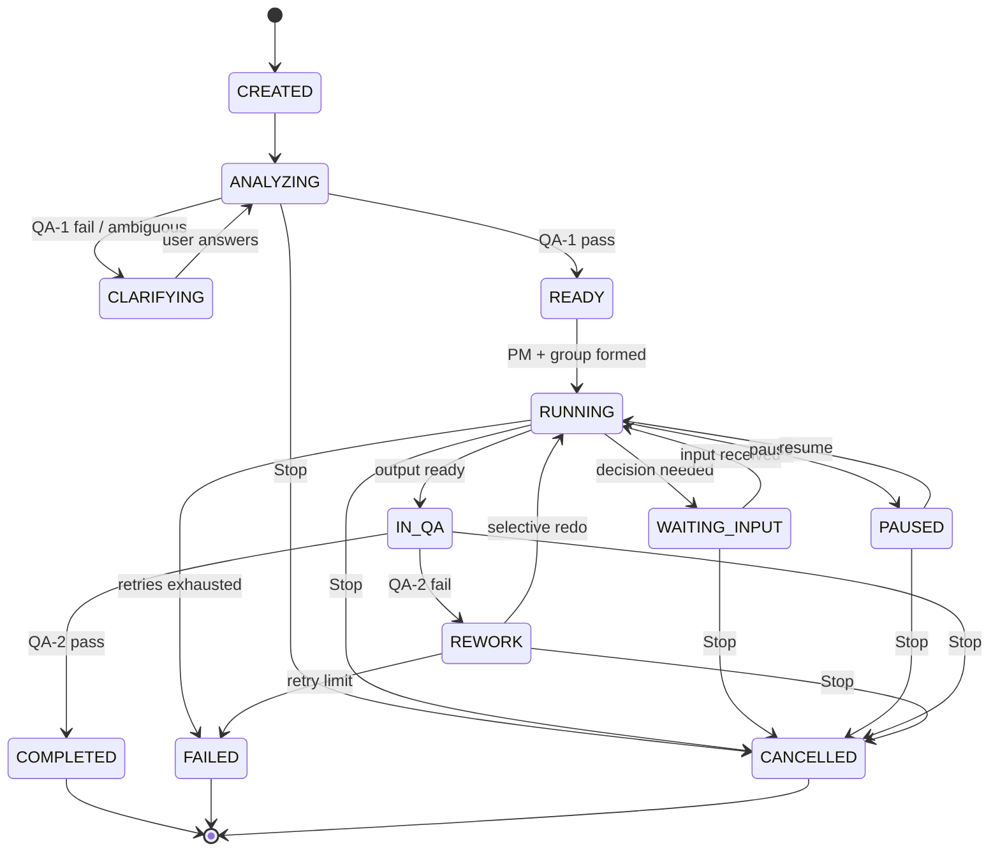

# AI WorkDesk OS — System Specification v0.1

| Field | Value |
| --- | --- |
| Document | AI WorkDesk OS Specification |
| Version | v0.1 (Draft for review) |
| Date | 2026-09-08 |
| Status | Draft — four foundation specs locked; open decisions tracked in §7 |
| Scope | 01 Task State Machine · 02 Communication Protocol · 03 Memory & Permission Architecture · 04 Worker/PM Data Schema |
| Next step | Phase 1 Core Engine implementation (see §8) |

> This document formalizes the concept in *Plan Multi Agent Assistant* into a machine-implementable
> foundation. It defines **what** the system must do and **which invariants** must hold; it deliberately
> does not choose a tech stack (see §7 Open Decisions).

---

## 0. Reading Guide

- **Spec 01–04** are the four locked foundations. Everything else in the product (UI, model router,
  worker creation, learning) must respect them.
- **Naming convention:** canonical identifiers are `UPPER_SNAKE` (states, message types, layers,
  permission levels). Every entity has a stable `id` and a UTC `ts` (ISO-8601).
- **Authority ladder (hard invariant):** `USER > MB > PM > WORKER`.
- **QA gates (hard invariant):** no task starts without QA-1 passing; no task completes without QA-2 passing.

---

## 1. Concepts & Terminology

| Term | Definition |
| --- | --- |
| **MB** | Main Brain — global orchestrator, final authority under USER |
| **PM** | Project Manager — persistent project employee, institutional memory of a project |
| **Worker** | Persistent AI employee = identity + personality + skills + tools + permissions + memory rules + experience + performance |
| **Skill** | Reusable capability unit attached to a Worker (file/script/API wrapper) |
| **QA-1** | Requirement QA — gate **before** work: ambiguity, contradiction, completeness, output clarity, feasibility |
| **QA-2** | Output QA — gate **after** work: accuracy, truthfulness, correctness, completeness, compliance, formatting, logic, technical function, source validity |
| **Task** | A unit of work requested by the user, owned by MB, executed by a PM + Task Group |
| **Task Group** | Temporary team: PM + Workers + shared requirements/files/artifacts/group memory |
| **Group Memory** | Short-term shared context of one Task Group (shortest-lived layer) |
| **Checkpoint** | Durable snapshot enabling rollback and resume |

---

## 2. Spec 01 — Task State Machine

### 2.1 Purpose

Guarantee that every task is **async, cancellable, resumable, auditable, and idempotent**, and that a
Worker waiting for input never freezes the group (§ concept 9).

### 2.2 Canonical Task States

| State | Meaning | State authority |
| --- | --- | --- |
| `CREATED` | Task record exists from user request; no requirement spec yet | MB |
| `ANALYZING` | MB is understanding the request; QA-1 evaluation in progress | MB |
| `CLARIFYING` | QA-1 failed or ambiguity found; MB is interacting with USER | MB |
| `READY` | Requirement spec approved by QA-1; task queued | MB |
| `RUNNING` | PM + Task Group actively executing | PM |
| `WAITING_INPUT` | Whole task blocked on USER decision/input (workers may still run non-blocked parts) | PM |
| `PAUSED` | Explicitly suspended by USER or system; fully resumable | MB |
| `IN_QA` | QA-2 review of produced output in progress | QA |
| `REWORK` | QA-2 failed; selective rework of the failed component assigned (not whole restart) | PM |
| `COMPLETED` | QA-2 passed; final result delivered | MB |
| `FAILED` | Unrecoverable (retries exhausted or hard error); preserved for inspection | MB |
| `CANCELLED` | USER issued Stop; state and artifacts preserved | MB |

### 2.3 Transition Table

| From | To | Trigger | Guard | Side effects |
| --- | --- | --- | --- | --- |
| `CREATED` | `ANALYZING` | MB accepts request | auth ok | write task record, emit event |
| `ANALYZING` | `CLARIFYING` | QA-1 fail / missing info | — | send clarification to USER (blocking on user channel only) |
| `CLARIFYING` | `ANALYZING` | USER reply received | reply correlated | merge answers into requirement spec |
| `ANALYZING` | `READY` | QA-1 pass | spec complete + feasible | freeze requirement spec v1, queue task |
| `READY` | `RUNNING` | PM created/assigned + group formed | group ready | start workers, open group channel + group memory |
| `RUNNING` | `WAITING_INPUT` | task-level decision needs USER | escalation reached USER | prompt USER; non-blocked sub-work continues |
| `WAITING_INPUT` | `RUNNING` | USER input/approval received | input matches pending request | apply input, resume |
| `RUNNING` | `PAUSED` | USER "Pause" or system policy | — | checkpoint first, suspend active tools |
| `PAUSED` | `RUNNING` | USER "Resume" | checkpoint exists | restore from checkpoint, resume |
| `RUNNING` | `IN_QA` | output bundle submitted | artifact manifest complete | run QA-2 |
| `IN_QA` | `REWORK` | QA-2 FAIL | failure report attached | PM identifies responsible worker/component |
| `REWORK` | `RUNNING` | rework assigned and started | retry counter < limit | redo only failed component |
| `IN_QA` | `COMPLETED` | QA-2 PASS | verdict record written | notify USER, archive |
| `RUNNING` / `REWORK` | `FAILED` | retry limit exhausted / hard error | no pending USER decision | emit failure report to MB → USER |
| any non-terminal | `CANCELLED` | USER "Stop" | cancel preempts | run Stop protocol §2.6 |
| `COMPLETED` / `FAILED` / `CANCELLED` | — | terminal | — | no further transitions |



### 2.4 Worker Sub-States (within a Task Group)

Workers are **not** frozen when blocked; the group engine keeps running.

| State | Meaning |
| --- | --- |
| `IDLE` | Available, no assignment |
| `WORKING` | Executing a tool/model call |
| `THINKING` | Planning / reasoning between actions |
| `COLLABORATING` | Exchanging messages with another Worker in the group |
| `WAITING_PM` | Escalated to PM, awaiting decision |
| `WAITING_MB` | Escalated to MB (cross-project / policy / capability) |
| `WAITING_USER` | Needs USER input; **does not block the group** |
| `WAITING_APPROVAL` | Permission level ASK/EXPLICIT pending |
| `ERROR` | Action failed; awaiting retry policy |
| `DONE` | Assigned component complete |

### 2.5 Checkpointing & Rollback

- A **checkpoint** is taken **before every major action**: model-call boundaries, tool executions with
  write side effects, QA verdicts, and rework assignment.
- Checkpoint contents: task spec, group membership, worker states, artifact manifest, memory deltas,
  tool-session references.
- Retention: keep the last **N = 3** checkpoints per task plus the pre-cancellation checkpoint (configurable).
- Rollback is **scoped**: on failure, restore only the failed component's artifacts + memory delta, then
  redo (§ concept 6 — no full-project restart).
- Checkpoints are append-only and referenced by the audit log.

### 2.6 Cancellation ("Stop" Protocol)

```
USER: "Stop"
  → MB emits CANCEL for the task
  → PM stops the Task Group (graceful window, default 30 s)
  → Workers finish current action at safe points, then terminate
  → Active tools closed gracefully; no new write side effects
  → Final checkpoint written; artifacts preserved
  → Task → CANCELLED (or PAUSED if USER said "pause")
```

- Force-cancel after the graceful window if a worker does not stop.
- `CANCELLED` keeps the task record, checkpoints, and artifacts so it can be inspected or resumed as a new task.

### 2.7 Resume & Idempotency

- Every state transition is **event-sourced**: the transition log is the source of truth; the task record
  can be rebuilt from it.
- Task state survives: app restart, computer restart, temporary API failure, worker failure, network failure.
- Every message carries an `idempotency_key`; duplicate deliveries are dropped.
- On resume, the PM rebuilds group state from the latest checkpoint and re-verifies artifact hashes before
  continuing.

### 2.8 Retry & Failure Policy

| Layer | Default retries | Backoff |
| --- | --- | --- |
| Tool call | 3 | 1 s, 2 s, 4 s |
| Worker stage | 2 | exponential, cap 30 s |
| QA-2 → rework cycles | 3 | — |
| Message delivery | 5 | 1 s → 30 s |

- Exceeding a limit escalates: Worker → PM → MB → USER.
- `FAILED` tasks are never silently dropped; they produce a structured failure report with evidence refs.

---

## 3. Spec 02 — Communication Protocol (MB ↔ PM ↔ Worker ↔ QA)

### 3.1 Principles

1. **Async by default** — no blocking waits; a waiting Worker never freezes the group.
2. **Correlated** — every message chains via `correlation_id`; every reply targets `reply_to`.
3. **Graded** — priorities, deadlines, and escalation paths are first-class.
4. **Auditable** — all messages carry `trace` (decision metadata, not chain-of-thought).

### 3.2 Envelope Schema

```json
{
  "msg_id": "uuid",
  "type": "REQUEST | REPLY | EVENT | COMMAND | QA_VERDICT | CLARIFY_REQUEST | APPROVAL_REQUEST | ESCALATION | HEARTBEAT | ACK",
  "version": "1.0",
  "from": { "role": "MB|PM|WORKER|QA|USER", "id": "string" },
  "to":   { "role": "MB|PM|WORKER|QA|USER", "id": "string" },
  "task_id": "uuid",
  "group_id": "uuid | null",
  "correlation_id": "uuid",
  "reply_to": "uuid | null",
  "priority": "CRITICAL | HIGH | NORMAL | LOW",
  "deadline_ts": "ISO-8601 | null",
  "ttl_ms": 60000,
  "idempotency_key": "string",
  "payload": { },
  "trace": [ { "actor": "string", "action": "string", "ts": "ISO-8601" } ]
}
```

### 3.3 Message Types

| Type | Direction | Purpose |
| --- | --- | --- |
| `COMMAND` | MB→PM, PM→WORKER | start/pause/cancel task, assign worker, execute, redo component |
| `REQUEST` / `REPLY` | any ↔ any | capability query, status query, info exchange |
| `EVENT` | any → bus | `task_state_changed`, `worker_state_changed`, `progress`, `artifact_created`, `memory_written` |
| `QA_VERDICT` | QA→PM/MB | QA-1 pass/fail (+ missing items) or QA-2 pass/fail (+ component map, severity, evidence) |
| `CLARIFY_REQUEST` / `CLARIFY_RESPONSE` | MB↔USER | requirement refinement |
| `APPROVAL_REQUEST` / `APPROVAL_RESPONSE` | WORKER→PM→MB→USER | permission levels ASK / EXPLICIT |
| `ESCALATION` | WORKER→PM→MB→USER | decision authority / capability / policy beyond current scope |
| `HEARTBEAT` | all agents | liveness |
| `ACK` | any → any | delivery confirmation |

### 3.4 Channels (logical queues)

| Channel | Traffic |
| --- | --- |
| `task.<id>.cmd` | commands and state transitions for one task (per-task FIFO) |
| `task.<id>.event` | task/worker state events (pub/sub) |
| `group.<id>` | worker collaboration within a Task Group |
| `escalation.<id>` | Worker → PM → MB → USER ladder |
| `user.in` / `user.out` | user-facing clarify / approval / notifications |
| `system.audit` | append-only audit events (§ 4.6) |

### 3.5 Interaction Patterns

**Escalation ladder (hard rule).** Escalate one level at a time; each level may answer or forward:

```
WORKER → PM → MB → USER
```

Escalate when: (a) decision authority is missing; (b) requested action exceeds the requester's
permission level; (c) capability gap detected; (d) QA rework loop limit hit; (e) ambiguity that changes
the outcome.

**Approval flow.** Worker requests → PM validates necessity → MB maps to permission level → USER is
prompted with context + proposed action → response returns through the same chain with the approval token.

**QA flows.**
- **QA-1** runs in `ANALYZING`; verdict `pass` moves to `READY`; verdict `fail` returns the missing items
  to MB, which issues `CLARIFY_REQUEST`.
- **QA-2** runs in `IN_QA`; verdict `fail` is a **structured failure report**: `{ component, severity,
  criteria_violated, evidence_refs }`. PM routes rework to the responsible worker only — never a full restart.

### 3.6 Reliability & Delivery

- At-least-once delivery with dedup via `idempotency_key`.
- `ACK` required; un-acked messages retried with exponential backoff (1 s → 30 s, max 5 attempts), then dead-lettered.
- Heartbeat: Workers 30 s, PM 15 s; missed heartbeats trigger slow-worker escalation.
- Request/reply default deadline **120 s**, overridable per message type and per task.

### 3.7 Ordering & Consistency

- Per-task, per-sender **FIFO**; cross-sender ordering established via sequence numbers on the event channel.
- **Single writer rule:** the PM is the state authority for its task's transitions; MB may override;
  QA never mutates task state — it only emits verdicts.

---

## 4. Spec 03 — Memory & Permission Architecture

### 4.1 Memory Layers

| Layer | Owner scope | Contents | Lifetime |
| --- | --- | --- | --- |
| `GLOBAL` | MB | user preferences, WorkDesk settings, global knowledge, long-term decisions | permanent |
| `PROJECT` | PM | project knowledge, decisions, previous tasks, worker performance, failures, successful workflows, lessons, conventions | as long as project exists |
| `GROUP` | PM + workers of one group | shared short-term collaboration context | task lifetime; auto-compacted at close |
| `WORKER` | the worker | identity, experience, performance | permanent per worker |

Memory is **partitioned, not centralized**: MB accesses memory by capability, not by loading everything
into context (§ concept 2).

### 4.2 Memory Record Schema

```json
{
  "mem_id": "uuid",
  "layer": "GLOBAL | PROJECT | GROUP | WORKER",
  "scope_id": "project_id | group_id | worker_id | global",
  "type": "preference|decision|knowledge|lesson|experience|convention|artifact_ref|qa_record",
  "content": "string",
  "source": { "role": "string", "id": "string" },
  "ts": "ISO-8601",
  "confidence": "HIGH | MEDIUM | LOW",
  "evidence_refs": ["uuid"],
  "ttl": "ISO-8601 | null",
  "access_scope": "token or role list",
  "immutable": false,
  "tags": ["string"]
}
```

### 4.3 Access Matrix (hard rule)

| Actor | GLOBAL | PROJECT (own) | GROUP (current) | WORKER (own) | Other project/group |
| --- | --- | --- | --- | --- | --- |
| USER | read; write via explicit statements | read (via UI) | read | read (via UI) | with MB grant |
| MB | read/write | read + authorized writes | read | read (stats) | **NEVER automatic** — explicit grant |
| PM | **no** | read/write | read/write | read worker performance (authorized) | no |
| WORKER | no (MB-granted exceptions) | no | read/write | read/write own profile/experience | no |
| QA | no | read task context + artifacts | read | no | no |

> **Cross-project access is NEVER automatic; only MB can grant an explicit scope** (§ concept 7).

### 4.4 Isolation Rules

- Every record carries an `access_scope` token; all reads are projection-filtered by the actor's token.
- No implicit inheritance beyond the matrix above.
- Grant/revoke events are audit-logged and reversible.

### 4.5 Learning System (evidence-gated, no uncontrolled self-rewrite)

```
Task → Result → QA → Experience → Lesson Candidate → Evidence / Confidence → Stored Lesson
```

- Lesson candidates are stored **separately** from validated lessons.
- Promotion requires **evidence**: ≥ 2 corroborating cases **or** explicit USER confirmation; otherwise the
  candidate stays at `MEDIUM`/`LOW` confidence.
- Example (§ concept 8): Excel worker → incorrect formulas → QA confirmed → candidate "formula validation
  should run after formatting" → 3 similar cases → HIGH confidence → stored in the worker's experience.
- **Identity/personality/boundary rules are never self-rewritten** — only MB (or the Worker Creator meta-worker)
  may change them, and only via registry upgrade.
- Capability-gap detection: MB decides `upgrade existing worker` vs `create new worker` (via Worker Creator).

### 4.6 Permission Model

**Levels (practical MVP scale):**

| Level | Behavior | Examples |
| --- | --- | --- |
| `AUTO` | execute silently; audit-log it | read a project file |
| `NOTIFY` | execute, then tell USER | create a new project file |
| `ASK` | USER approves before execution | modify important project configuration |
| `EXPLICIT` | explicit, high-impact confirmation | install software, delete important files, external actions |

**Policy tuple:**

```
(actor, action, resource_pattern, tool, condition, level, scope)
```

**Resolution order (hard rule):** most specific match wins → **deny by default** → runtime USER override
(session-scoped) → grant logged.

**Tool permission examples (§ concept 10):**

| Tool / resource | Permission |
| --- | --- |
| Terminal | allowed |
| Project folder | read/write |
| System folders | blocked |
| Software installation | requires USER (EXPLICIT) |
| Delete project | requires USER (EXPLICIT) |

> Principle: **having a tool ≠ unlimited permission to use it.**

**Approval record** (persisted, referenced by audit):

```json
{
  "approval_id": "uuid",
  "request_id": "uuid",
  "requester": { "role": "string", "id": "string" },
  "action": "string",
  "resource": "string",
  "tool": "string",
  "level": "ASK | EXPLICIT",
  "status": "PENDING | APPROVED | DENIED | EXPIRED",
  "decision_ts": "ISO-8601 | null",
  "decision_context": "string"
}
```

**Audit log** — decision/event metadata only, not chain-of-thought (§ concept 15):

```json
{
  "seq": 1,
  "ts": "ISO-8601",
  "actor": { "role": "string", "id": "string" },
  "action": "string",
  "tool": "string | null",
  "files_changed": ["path"],
  "reason": "short MB/PM decision note",
  "qa_refs": ["verdict_id"],
  "rework_refs": ["rework_id"]
}
```

Example sequence: `14:32 MB selected Coding Worker → 14:33 Worker opened /Project/src → 14:35 Worker
created app.py → 14:37 QA detected missing error handling → 14:38 PM assigned rework → 14:41 QA passed`.

Audit is **append-only**; retention is configurable; it survives restart (durable store).

---

## 5. Spec 04 — Worker / PM Data Schema

### 5.1 Worker Profile

```json
{
  "worker_id": "uuid",
  "name": "string",
  "avatar": "ref | null",
  "description": "string",
  "role_class": "string",
  "personality": {
    "traits": ["string"],
    "tone": "string",
    "formality": "CASUAL | NEUTRAL | FORMAL"
  },
  "behavior_rules": ["string"],
  "communication_style": "string",
  "ooc_rules": ["string"],
  "skills": [
    { "skill_id": "uuid", "primary": true, "params": {} }
  ],
  "tools": [
    { "tool": "BROWSER|TERMINAL|VSCODE|WORD|POWERPOINT|EXCEL|FILESYSTEM|...",
      "permissions": { "allowed_apps": [], "allowed_folders": [], "read": true, "write": true, "delete": false } }
  ],
  "permissions": {
    "default_level": "AUTO|NOTIFY|ASK|EXPLICIT",
    "overrides": [ "policy tuple" ]
  },
  "memory_rules": {
    "allowed_layers": ["GROUP", "WORKER"],
    "retention_days": 180
  },
  "experience": {
    "lessons": ["lesson_id"],
    "successful_workflows": ["ref"],
    "failed_workflows": ["ref"]
  },
  "performance": {
    "times_triggered": 0,
    "tasks_completed": 0,
    "qa_pass_rate": 0.0,
    "failure_rate": 0.0,
    "avg_execution_time_ms": 0,
    "last_updated": "ISO-8601"
  },
  "status": "IDLE|WORKING|THINKING|COLLABORATING|WAITING_PM|WAITING_MB|WAITING_USER|WAITING_APPROVAL|ERROR|DONE|OFFLINE",
  "model_preferences": {
    "capability_tags": ["coding", "reasoning"],
    "privacy_level": "LOCAL_PREFERRED | ANY",
    "cost_limit": "string | null"
  },
  "schema_version": 1,
  "created_ts": "ISO-8601",
  "updated_ts": "ISO-8601"
}
```

> Workers do **not** hard-bind a model. They request capability (`"I need a capable coding model"`); the
> Model Router decides local vs cloud (§ concept 12).

### 5.2 Skill Schema

```json
{
  "skill_id": "uuid",
  "name": "string",
  "version": "semver",
  "type": "BUILTIN | SKILL_FILE | GITHUB",
  "entry_point": "string",
  "params_schema": {},
  "tools_required": ["string"],
  "permissions_required": ["string"],
  "memory_hooks": ["GLOBAL|PROJECT|GROUP|WORKER"],
  "qa_hints": ["string"],
  "docs_ref": "string | null",
  "installed_ts": "ISO-8601",
  "enabled": true
}
```

### 5.3 PM Schema

```json
{
  "pm_id": "uuid",
  "name": "string",
  "attached_project_id": "uuid",
  "status": "AVAILABLE | ACTIVE | RETIRED",
  "knowledge": ["mem_id"],
  "decisions": [
    { "decision": "string", "context": "string", "ts": "ISO-8601", "outcome": "string" }
  ],
  "worker_performance_map": { "worker_id": "performance record" },
  "lessons": ["lesson_id"],
  "conventions": ["string"],
  "task_history": ["task_id"],
  "group_history": ["group_id"],
  "schema_version": 1,
  "created_ts": "ISO-8601",
  "updated_ts": "ISO-8601"
}
```

> PM is **persistent** and attached to the project across Task Groups; it never auto-reads unrelated
> project memory (§ concept 3).

### 5.4 Task Group Schema (minimal)

```json
{
  "group_id": "uuid",
  "task_id": "uuid",
  "pm_id": "uuid",
  "member_worker_ids": ["uuid"],
  "shared_requirements_ref": "mem_id",
  "artifacts_manifest": ["ref"],
  "memory_scope_id": "uuid",
  "created_ts": "ISO-8601",
  "closed_ts": "ISO-8601 | null"
}
```

### 5.5 Registry & Lifecycle

- Registry states: `REGISTERED → AVAILABLE → ACTIVE → SUSPENDED → RETIRED`.
- Worker creation paths (§ concept 5): GitHub skill · Skill Creator Worker · manual · PM request ·
  capability-gap detection.
- **Upgrade keeps statistics and experience**; a new schema version migrates data forward.

### 5.6 Performance Statistics

- `qa_pass_rate = passed / (passed + failed)` over a recent window (default: last 100 QA events).
- `failure_rate` and `avg_execution_time_ms` computed per task type, exponentially decayed (EWMA,
  α = 0.2) so old results fade.
- Statistics feed Worker selection and PM's worker-performance memory; they are **not** user-visible
  chain-of-thought.

### 5.7 Versioning & Migration

- Every record carries `schema_version`; migrations are additive by default.
- Unknown fields are preserved; downgrades are rejected.

---

## 6. Cross-Spec Invariants

1. **Authority:** `USER > MB > PM > WORKER` — enforced by the permission engine in every message route.
2. **Async execution:** no blocking wait; a Worker waiting for USER never freezes the group.
3. **QA gates:** no `READY` without QA-1 pass; no `COMPLETED` without QA-2 pass.
4. **Memory isolation:** cross-project access never automatic; MB grants explicitly.
5. **Audit everything:** state transitions, tool calls, file changes, QA verdicts, rework, approvals,
   grants — all append-only.
6. **Checkpoint before major actions:** rollback is scoped to the failed component.
7. **Evidence-gated learning:** lessons are stored only with evidence/confidence; identity and
   personality are never self-rewritten.

---

## 7. Open Decisions (to lock before Phase 1 coding)

| # | Decision | Candidates | Owner |
| --- | --- | --- | --- |
| 1 | Persistence for task state + event log | SQLite / Postgres / embedded event store | MB (system) |
| 2 | Message bus implementation | in-process queue / Redis / NATS / RabbitMQ | MB (system) |
| 3 | Memory store | SQL / vector hybrid; retention defaults | MB (system) |
| 4 | Model Router first cut | local (Ollama) vs cloud; routing table format | MB (system) |
| 5 | Audit retention policy | default duration + size cap | MB (system) |
| 6 | Worker runtime isolation | container / process / in-process | MB (system) |
| 7 | Exact permission resolution edge cases | resource pattern grammar | MB (system) |
| 8 | UI scope for Phase 1 | none (headless) vs minimal Work Graph | USER |

---

## 8. Mapping to Phase 1 Core Engine

| Phase 1 component | Spec sections that define it |
| --- | --- |
| Task Engine | §2 (Task State Machine) |
| Message Bus | §3.2–3.7 |
| Worker Registry | §5.1, §5.5 |
| PM Registry | §5.3, §5.5 |
| Agent Runtime | §3 (protocol), §2.4 (worker sub-states) |
| State Machine | §2 |
| Memory Manager | §4.1–4.4 |
| Permission Manager | §4.6 |
| Audit Logger | §4.6 (audit schema) |

---

## Appendix A — Glossary

| Term | Meaning |
| --- | --- |
| WorkDesk | The Windows-hosted product shell: UI + orchestration + runtime |
| Virtual Office | Visualization layer showing roles, states, and task progress |
| Work Graph | Visualization of task structure: MB → PM → Workers → QA → result |
| Worker Creator | Meta-worker whose job is to design/upgrade other workers |
| Model Router | Layer deciding local vs cloud vs API per task (complexity, privacy, cost, speed, context, capability, tools, preference) |
| Capability Gap | Situation where no existing worker can properly perform the task |
